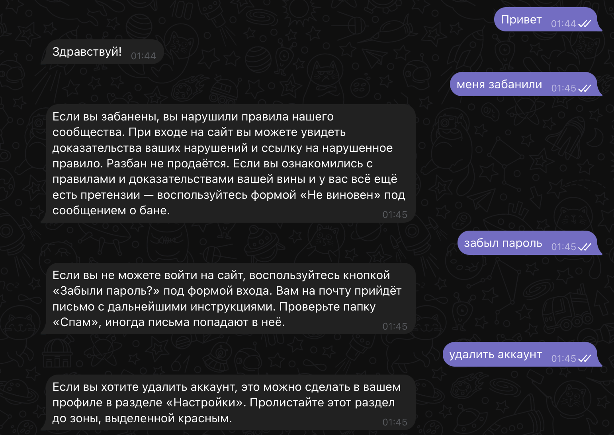
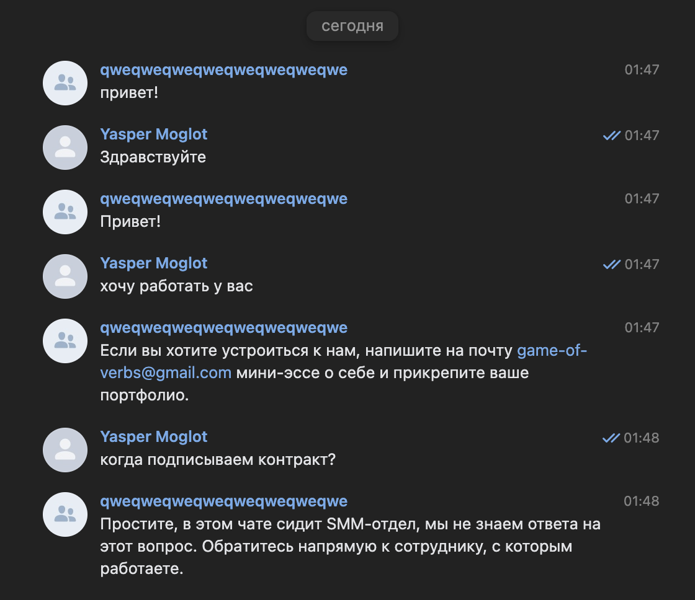

# Dialogflow‑Powered Chat Bots

This repository contains two small Python chat‑bot projects that connect Google Dialogflow to popular messaging platforms

## Live demos
Telegram - https://t.me/gazzilion_smart_bot

VK - https://vk.com/club228945309




## Environment

### Requirements
you should install all dependencies using:

```bash
pip install -r requirements.txt
```

### Environment variables
first you should add some values ​​in .env file:

- PROJECT_ID - GCP project id that hosts your Dialogflow agent.
- TG_BOT_TOKEN - your telegram bot's token.
- VK_TOKEN - your group token in vk.
- TG_ADMIN_ID - Your personal Telegram user id.
- VK_ADMIN_ID - Your personal VK user id.

Admin tokens are used for logging exceptions.

- GOOGLE_APPLICATION_CREDENTIALS - path to credentials.json: See below.

#### GCP credentials
To get json file you should:
1. Open Google Cloud Console → IAM & Admin → Service Accounts.
2. Create service account → give it the role Dialogflow API Client.
3. Click the account → Keys → Add key → JSON → download the file.
4. Add path to this file `.env`.

[Official guide](https://developers.google.com/workspace/guides/create-credentials) for more details.

## Scipts
- teach_dialogflow.py - Script for intents to your DialogFlow. For using script you have to create a json file with similar content:
```json
{
    "Устройство на работу": {
        "questions": [
            "Как устроиться к вам на работу?",
            "Как устроиться к вам?",
        ],
        "answer": "Если вы хотите устроиться к нам, напишите на почту game-of-verbs@gmail.com мини-эссе о себе и прикрепите ваше портфолио."
    },
    "Забыл пароль": {
        "questions": [
            "Не помню пароль",
            "Не могу войти",
        ],
        "answer": "Если вы не можете войти на сайт, воспользуйтесь кнопкой «Забыли пароль?» под формой входа. Вам на почту прийдёт письмо с дальнейшими инструкциями. Проверьте папку «Спам», иногда письма попадают в неё."
    }
}
```
And add PATH_TO_JSON key to `env` file. Then you should run script using:
```bash
python3 teach_dialogflow.py
```
- tg_bot.py - Telegram bot. You should run this script using:
```bash
python3 tg_bot.py
```
- vk.bot.py - VK bot. You should run this script using:
```bash
python3 vk_bot.py
```
